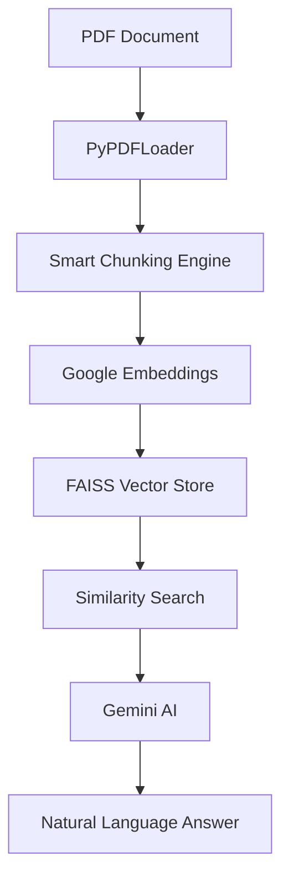

# 📋 Technical Documentation - PDF Q&A System

## 🏗️ Architecture Overview

The PDF Q&A system is built using a modular architecture that combines document processing, vector storage, and AI-powered question answering.

### System Components



## 🔧 Core Classes and Methods

### `PDFVectorDB` Class

The main class that handles all PDF processing and Q&A functionality.

#### Initialization
```python
class PDFVectorDB:
    def __init__(self):
        self.embeddings = GoogleGenerativeAIEmbeddings(model="models/embedding-001")
        self.vector_store = None
        self.documents = []
        self.current_pdf_path = None
        self.database_created = False
```

#### Key Methods

##### `load_pdf(pdf_path, chunk_size=300, chunk_overlap=50)`
**Purpose**: Load and process a PDF file into searchable chunks.

**Parameters**:
- `pdf_path` (str): Path to the PDF file
- `chunk_size` (int): Size of text chunks for processing
- `chunk_overlap` (int): Overlap between consecutive chunks

**Process Flow**:
1. Check if PDF is already loaded
2. Load PDF using PyPDFLoader
3. Apply smart chunking strategy
4. Store processed documents
5. Reset database status

**Example**:
```python
pdf_db.load_pdf("document.pdf", chunk_size=200, chunk_overlap=30)
```

##### `_create_car_specific_chunks(documents)`
**Purpose**: Create intelligent chunks optimized for automotive content.

**Strategies**:
1. **Brand Detection**: Identifies car brands in text
2. **Year Pattern Recognition**: Finds model years (2000-2025)
3. **Keyword Matching**: Looks for automotive terms
4. **Fallback Chunking**: Traditional splitting when car-specific fails

**Car Brands Supported**:
- Toyota, Honda, Ford, BMW, Audi
- Mercedes, Nissan, Hyundai, Chevrolet, Volkswagen

##### `create_vector_database(save_path="pdf_vector_db")`
**Purpose**: Create FAISS vector database from processed documents.

**Process**:
1. Validate documents are loaded
2. Check if database already exists
3. Generate embeddings using Google AI
4. Create FAISS index
5. Save to disk
6. Display chunk type distribution

##### `search(query, k=3)`
**Purpose**: Perform semantic search with detailed debugging.

**Features**:
- Similarity scoring
- Query term detection
- Content preview
- Metadata display
- Debug information

**Returns**: List of relevant Document objects

##### `answer_question(question)`
**Purpose**: Generate AI-powered answers using retrieved context.

**Process**:
1. Perform similarity search (k=5)
2. Combine relevant chunks as context
3. Create structured prompt for Gemini
4. Generate and return answer

## 🧠 Smart Chunking Algorithm

### Primary Strategy: Car-Specific Chunking

```python
def _create_car_specific_chunks(self, documents):
    # Strategy 1: Brand-based splitting
    line_starts_with_brand = any(line.startswith(brand) for brand in car_brands)
    
    # Strategy 2: Content-based detection
    line_contains_brand = any(brand in line for brand in car_brands)
    
    # Strategy 3: Year pattern matching
    has_year = any(word.isdigit() and len(word) == 4 and 2000 <= int(word) <= 2025 
                   for word in words)
```

### Fallback Strategies

1. **Alternative Parsing**: Aggressive pattern matching
2. **Sentence Splitting**: Regex-based sentence separation
3. **Traditional Chunking**: CharacterTextSplitter with smaller chunks

### Chunk Metadata

Each chunk includes:
- `chunk_type`: Type of chunking applied
- `car_info`: Boolean indicating automotive content
- `page`: Source page number

## 🔍 Search Engine Details

### FAISS Vector Store

**Configuration**:
- Index Type: Flat (exact search)
- Embedding Model: Google `models/embedding-001`
- Similarity Metric: Cosine similarity

### Search Process

1. **Query Embedding**: Convert search query to vector
2. **Similarity Calculation**: Compare with all document vectors
3. **Ranking**: Sort by similarity score
4. **Filtering**: Return top-k results
5. **Post-processing**: Add metadata and debug info

### Debug Features

```python
def _debug_search(self, query):
    # Direct text matching
    matching_chunks = [chunk for chunk in self.documents 
                      if query.lower() in chunk.page_content.lower()]
    
    # Content sampling
    sample_content = [doc.page_content[:100] for doc in self.documents[:3]]
```

## 🤖 AI Integration

### Google Gemini 2.0 Flash

**Model Configuration**:
```python
model = genai.GenerativeModel('gemini-2.0-flash-exp')
```

**Prompt Structure**:
```python
prompt = f"""
Based on the following document content, please answer the question accurately and concisely.
If the information is not available in the context, please say so.

Context:
{context}

Question: {question}

Answer:
"""
```

### Embedding Model

**Model**: `models/embedding-001`
**Provider**: Google Generative AI
**Dimension**: 768 (typical for Google embeddings)

## 📊 Performance Considerations

### Chunk Size Optimization

| Document Type | Recommended Chunk Size | Overlap |
|---------------|------------------------|---------|
| Car Inventory | 200-300 characters    | 20-30   |
| Technical Docs| 500-800 characters    | 50-100  |
| Research Papers| 300-500 characters   | 30-50   |

### Memory Usage

- **Small PDF** (< 10 pages): ~50MB RAM
- **Medium PDF** (10-100 pages): ~200MB RAM
- **Large PDF** (> 100 pages): ~500MB+ RAM

### Search Performance

- **Index Creation**: O(n) where n = number of chunks
- **Search Query**: O(log n) for approximate search
- **Exact Search**: O(n) for exhaustive comparison

## 🔧 Configuration Options

### Environment Variables

```env
# Required
GOOGLE_API_KEY=your-api-key-here

# Optional
CHUNK_SIZE=300
CHUNK_OVERLAP=50
MAX_SEARCH_RESULTS=10
DEBUG_MODE=false
```

### Customization Points

#### Custom Chunking Strategy
```python
def custom_chunking_strategy(self, documents):
    # Implement your domain-specific chunking
    # Return List[Document]
    pass
```

#### Custom Search Filters
```python
def filtered_search(self, query, filters=None):
    # Add metadata-based filtering
    # Return filtered results
    pass
```

## 🚨 Error Handling

### Common Exceptions

#### `FileNotFoundError`
```python
try:
    pdf_db.load_pdf("nonexistent.pdf")
except FileNotFoundError:
    print("PDF file not found")
```

#### `API Key Errors`
```python
if "GOOGLE_API_KEY" not in os.environ:
    raise ValueError("Google API key not configured")
```

#### `Empty Database Errors`
```python
def search(self, query, k=3):
    if not self.vector_store:
        print("❌ No vector database found. Please create one first.")
        return []
```

## 🧪 Testing and Validation

### Unit Tests

```python
# Test chunking
def test_car_chunking():
    sample_text = "Toyota Corolla 2020 Price: $18,500"
    chunks = pdf_db._create_car_specific_chunks([Document(page_content=sample_text)])
    assert len(chunks) > 0
    assert chunks[0].metadata['car_info'] == True

# Test search
def test_search_functionality():
    results = pdf_db.search("Toyota", k=1)
    assert len(results) > 0
    assert "toyota" in results[0].page_content.lower()
```

### Performance Benchmarks

| Operation | Small PDF | Medium PDF | Large PDF |
|-----------|-----------|------------|-----------|
| Loading   | < 1s      | 2-5s       | 10-30s    |
| Chunking  | < 1s      | 1-3s       | 5-15s     |
| Indexing  | 2-5s      | 10-30s     | 60-180s   |
| Search    | < 0.1s    | < 0.2s     | < 0.5s    |

## 🔄 Maintenance and Updates

### Database Versioning

Save databases with version info:
```python
def save_with_version(self, path, version="1.0"):
    metadata = {
        "version": version,
        "created": datetime.now().isoformat(),
        "chunk_count": len(self.documents)
    }
    # Save metadata alongside FAISS index
```

### Model Updates

When updating embedding models:
1. Save current database
2. Update model configuration
3. Recreate embeddings
4. Validate search performance
5. Compare with previous version

## 🔗 Integration Points

### External Systems

#### REST API Wrapper
```python
from flask import Flask, request, jsonify

app = Flask(__name__)
pdf_db = PDFVectorDB()

@app.route('/search', methods=['POST'])
def search_api():
    query = request.json['query']
    results = pdf_db.search(query)
    return jsonify([doc.page_content for doc in results])
```

#### Batch Processing
```python
def process_multiple_pdfs(pdf_paths):
    for path in pdf_paths:
        pdf_db.load_pdf(path)
        pdf_db.create_vector_database(f"db_{path.stem}")
```

## 📈 Monitoring and Logging

### Performance Metrics

```python
import time
import logging

def monitored_search(self, query, k=3):
    start_time = time.time()
    results = self.search(query, k)
    duration = time.time() - start_time
    
    logging.info(f"Search query: {query}, Results: {len(results)}, Duration: {duration:.2f}s")
    return results
```

### Usage Analytics

Track common queries and performance patterns for optimization.

---

**For implementation examples and quick start guide, see README.md**
